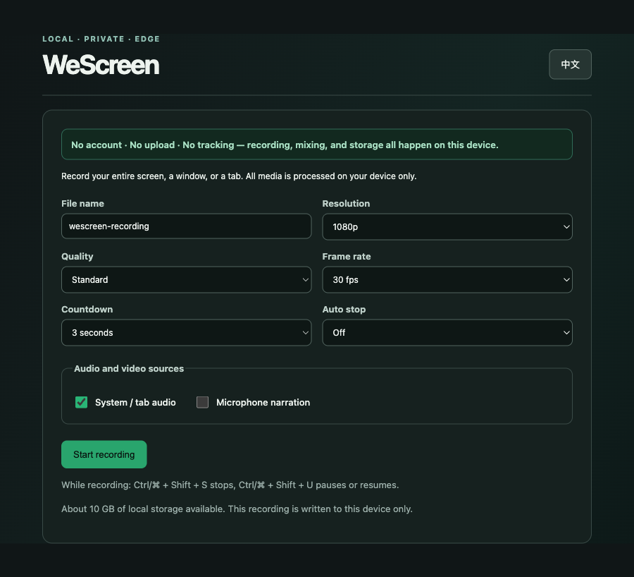
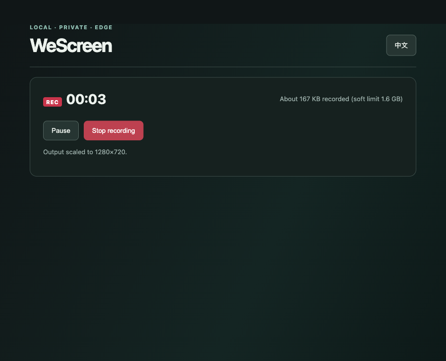

<p align="center">
  
</p>

<h1 align="center">WeScreen</h1>

<p align="center">
  <strong>Screen recording for Microsoft Edge that never leaves your machine.</strong><br>
  No account. No upload. No tracking.
</p>

<p align="center">
  <a href="README.zh-CN.md">中文</a> ·
  <a href="#install">Install</a> ·
  <a href="#usage">Usage</a> ·
  <a href="#features">Features</a> ·
  <a href="#known-limitations">Limitations</a> ·
  <a href="CHANGELOG.md">Changelog</a>
</p>

<p align="center">
  
  
  
  
  
</p>

---

WeScreen records your entire screen, a single window, or a browser tab and saves it as a WebM
file. Recording, audio mixing, and storage all happen inside your browser — there is no server,
no sign-in, and no telemetry. It is a plain unpacked Manifest V3 extension: no build step, no
bundler, no dependencies.

## Why local-first matters

Most screen recorders ask you to upload your take before you can do anything with it. WeScreen
does the opposite: the file is written to your disk and nowhere else.

- **No account** — there is no backend to sign in to.
- **No upload** — video never leaves the device, so nothing can leak from a server that does not exist.
- **No tracking** — no analytics scripts, no remote code, no permissions beyond recording.

WeScreen requests exactly two permissions:

| Permission | Why |
| --- | --- |
| `storage` | Saves your preferences and the recording chunks buffered on disk for crash recovery |
| `downloads` | Writes the finished WebM to your Downloads folder |

What gets captured is decided entirely by the browser's own sharing picker. WeScreen cannot read
your screen unless you pick a source, and it cannot see anything you did not share.

## Install

1. Open `edge://extensions/` in Microsoft Edge.
2. Turn on **Developer mode** in the left sidebar.
3. Click **Load unpacked**.
4. Select this repository's root folder.
5. Click the WeScreen icon in the toolbar, then **Start recording**.

## Usage

1. Pick a file name, resolution, frame rate, quality preset, countdown, and an optional auto-stop.
2. Choose your audio sources: system/tab audio, microphone narration, or both.
3. Click **Start recording** and pick what to share in the Edge picker.
4. Pause, resume, or stop from the recorder page, the toolbar badge, or the keyboard.
5. Preview the result and download it as WebM.

With the countdown set, the recorder waits 3 or 5 seconds after you confirm the shared source, so
you have time to switch to the window you want to demonstrate.

<p align="center">
  
</p>

While recording, the header keeps a running total of what has been captured against the soft
ceiling for a single take:

<p align="center">
  
</p>

## Features

**Recording control**
- 3 or 5 second countdown, pause/resume, auto-stop after 5/15/30 minutes
- Global stop and pause/resume shortcuts that work while another app has focus
- Custom file name, applied to the downloaded file

**Audio**
- System / tab audio and microphone narration mixed locally through a Web Audio graph
- Independent toggles for each source; noise suppression and echo cancellation on the microphone
- A denied microphone or a source without audio degrades the take with an explicit notice instead of failing the recording

**Output quality**
- Resolution cap (source / 1080p / 720p) applied to the capture track, with the real output size reported back
- Frame rate (30 / 60 fps) and quality presets (standard / high / space saver) chosen independently
- In-browser preview before you download

**Reliability**
- Chunks are written to IndexedDB every second, so an unexpected close can be recovered
- The recorder shows how much has been captured against a soft ceiling and warns before memory runs out
- Free local storage is surfaced, with a warning below 500 MB
- Closing the tab mid-recording asks for confirmation first

**Interface**
- Chinese and English UI, following the browser language and switchable from the recorder
- Localized extension name, description, and command labels

## Keyboard shortcuts

| Shortcut | Action |
| --- | --- |
| `Ctrl/⌘ + Shift + S` | Stop recording |
| `Ctrl/⌘ + Shift + U` | Pause or resume recording |

These are Edge extension commands, so they fire even when the recorder tab is in the background.
Rebind them at `edge://extensions/shortcuts`.

## Known limitations

- **WebM only.** That is what the browser records natively. Convert to MP4 with ffmpeg, HandBrake, or 剪映 if you need it.
- **A ~1.6 GB soft ceiling per take.** Chunks are persisted to disk while recording, but stopping still assembles the whole take into a single in-memory Blob. The recorder warns at 800 MB and turns red at 1.6 GB; for longer sessions, record in parts.
- **Crash recovery is best-effort.** Whatever chunks reached IndexedDB before a crash can be recovered; the last second or so may be missing.
- **No editing yet.** No trimming, no annotations, no camera overlay, no MP4/GIF export.

## Development

There is nothing to build. Edit a file, then press **Reload** on the extension card at
`edge://extensions/`.

```
manifest.json   Extension manifest, permissions, and keyboard commands
background.js   Service worker: command routing and the REC toolbar badge
recorder.html   Recorder page: setup, recording, result, and recovery views
recorder.js     Capture, audio mixing, MediaRecorder lifecycle, IndexedDB chunk store
recorder.css    Recorder page styling
popup.html/js   Toolbar popup
_locales/       Localized manifest strings (zh_CN, en)
assets/         Logo and store artwork
```

Two implementation notes worth knowing before you change anything:

- **The bitrate is not the resolution.** Quality presets only set `videoBitsPerSecond`; the resolution cap is a separate `applyConstraints` call on the capture track. Keep them independent.
- **IndexedDB is not a memory fix.** It survives a crash, but the take is still assembled in the tab heap when you stop, which is what the size warnings measure.

## Credits

Logo artwork generated with 豆包 AI. The bundled `assets/logo.png` has the generator watermark
cropped out and its white background converted to transparency so it renders on both GitHub
themes.
