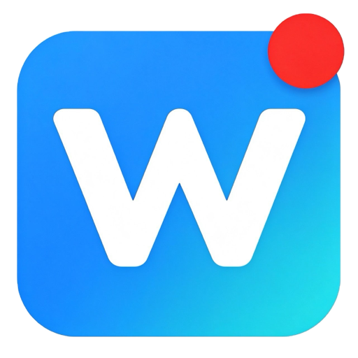
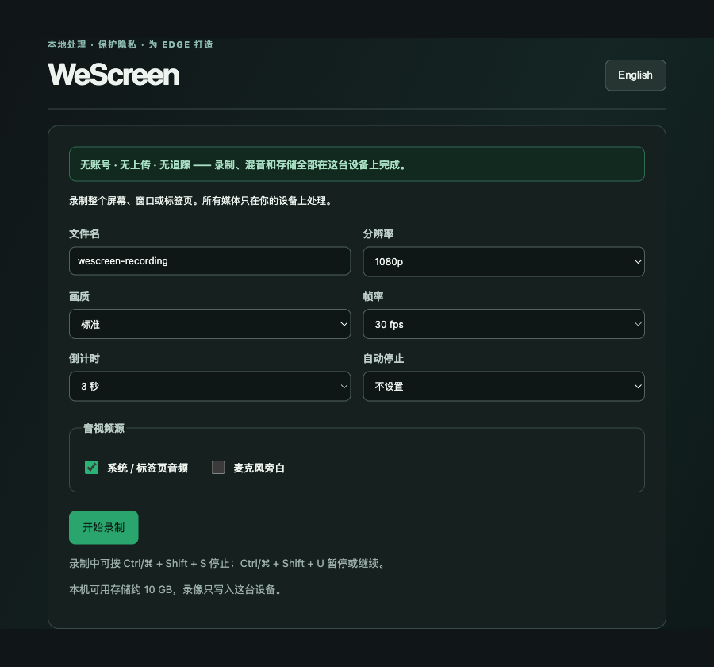
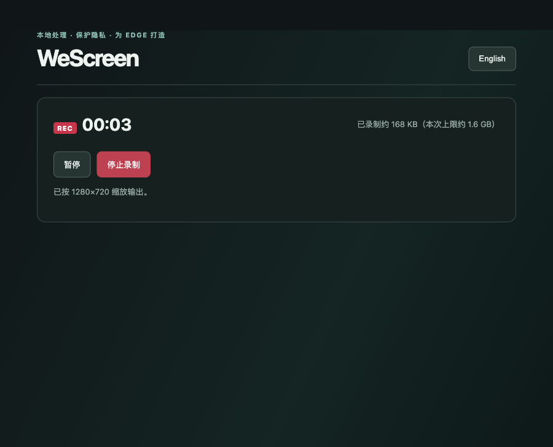

<p align="center">
  
</p>

<h1 align="center">WeScreen</h1>

<p align="center">
  <strong>为 Edge 打造的录屏扩展，录像从不离开你的电脑。</strong><br>
  无账号 · 无上传 · 无追踪
</p>

<p align="center">
  <a href="README.md">English</a> ·
  <a href="#安装">安装</a> ·
  <a href="#使用">使用</a> ·
  <a href="#功能">功能</a> ·
  <a href="#已知限制">已知限制</a> ·
  <a href="CHANGELOG.md">更新日志</a>
</p>

<p align="center">
  
  
  
  
  
</p>

---

WeScreen 可以录制整个屏幕、单个窗口或浏览器标签页，并保存为 WebM 文件。录制、音频混音和存储
全部在你的浏览器内完成——没有服务器、不需要登录、不含遥测。它是一个普通的解压缩 Manifest V3
扩展：无需构建步骤、无打包工具、无第三方依赖。

## 为什么"本地优先"重要

大多数录屏工具要求你先上传，才能对录像做任何事。WeScreen 反过来：文件只写入你的磁盘，不去别处。

- **无账号** —— 根本没有需要登录的后端。
- **无上传** —— 视频从不离开这台设备，不存在服务器，也就无从泄露。
- **无追踪** —— 没有分析脚本、没有远程代码、没有与录制无关的权限。

WeScreen 只申请两项权限：

| 权限 | 用途 |
| --- | --- |
| `storage` | 保存你的偏好设置，以及为崩溃恢复而缓存在本机的录制分片 |
| `downloads` | 把录制完成的 WebM 写入下载目录 |

录什么完全由浏览器自带的共享选择器决定。除非你主动选择共享源，WeScreen 无法读取你的屏幕，
也看不到任何你没有共享的内容。

## 安装

1. 在 Microsoft Edge 打开 `edge://extensions/`。
2. 打开左侧的**开发人员模式**。
3. 点击**加载解压缩的扩展**。
4. 选择本仓库根目录。
5. 点击工具栏上的 WeScreen 图标，再点击**开始录制**。

## 使用

1. 设置文件名、分辨率、帧率、画质预设、倒计时，以及可选的自动停止。
2. 选择音频来源：系统/标签页音频、麦克风旁白，或两者都要。
3. 点击**开始录制**，并在 Edge 的选择器中决定共享什么。
4. 通过录制页面、工具栏徽标或快捷键来暂停、继续或停止。
5. 预览结果，然后下载为 WebM。

设置倒计时后，录制器会在你确认共享源之后等待 3 或 5 秒，方便你切换到要演示的窗口。

<p align="center">
  
</p>

录制过程中，顶部会持续显示本次录制已写入的体积与软上限：

<p align="center">
  
</p>

## 功能

**录制控制**
- 3 秒或 5 秒倒计时、暂停/继续、5/15/30 分钟后自动停止
- 全局停止与暂停/继续快捷键，其他应用获得焦点时同样有效
- 自定义文件名，直接应用到下载的文件

**音频**
- 系统/标签页音频与麦克风旁白通过 Web Audio 图在本地混音
- 两个来源可独立开关；麦克风启用降噪与回声消除
- 麦克风被拒绝或共享源没有音频时，会明确提示降级继续录制，而不是让录制失败

**输出质量**
- 分辨率上限（原始 / 1080p / 720p）应用到采集轨道，并回报真实输出尺寸
- 帧率（30 / 60 fps）与画质预设（标准 / 高画质 / 节省空间）彼此独立
- 下载前在浏览器内预览

**可靠性**
- 分片每秒写入 IndexedDB，意外关闭后可恢复
- 录制中显示已录制体积与软上限，在内存耗尽前给出提示
- 显示本机可用存储，低于 500 MB 时警告
- 录制中关闭标签页会先请求确认

**界面**
- 中英文界面，跟随浏览器语言，也可在录制页面切换
- 扩展名称、描述与快捷键说明同样本地化

## 快捷键

| 快捷键 | 动作 |
| --- | --- |
| `Ctrl/⌘ + Shift + S` | 停止录制 |
| `Ctrl/⌘ + Shift + U` | 暂停或继续录制 |

这些是 Edge 扩展命令，因此录制标签页在后台时同样生效。可在 `edge://extensions/shortcuts` 重新绑定。

## 已知限制

- **只输出 WebM。** 这是浏览器原生录制格式。需要 MP4 时可用 ffmpeg、HandBrake 或剪映转换。
- **单次录制约 1.6 GB 软上限。** 录制时分片会持久化到磁盘，但停止时仍要把整段录像在内存中拼装成一个 Blob。录制器在 800 MB 变黄、1.6 GB 变红；更长内容建议分段录制。
- **崩溃恢复尽力而为。** 崩溃前已写入 IndexedDB 的分片可以恢复，最后约一秒可能缺失。
- **暂无剪辑能力。** 没有裁剪、标注、摄像头画中画，也没有 MP4/GIF 导出。

## 开发

没有构建步骤。改完文件后在 `edge://extensions/` 的扩展卡片上点**重新加载**即可。

```
manifest.json   扩展清单、权限与快捷键命令
background.js   Service Worker：命令转发与 REC 工具栏徽标
recorder.html   录制页面：设置、录制中、结果与恢复视图
recorder.js     采集、音频混音、MediaRecorder 生命周期、IndexedDB 分片存储
recorder.css    录制页面样式
popup.html/js   工具栏弹窗
_locales/       清单字符串本地化（zh_CN、en）
assets/         图标与商店素材
```

动手改之前，有两点实现约定值得知道：

- **码率不等于分辨率。** 画质预设只设置 `videoBitsPerSecond`；分辨率上限是独立的 `applyConstraints` 调用。两者保持解耦。
- **IndexedDB 不是内存问题的解法。** 它解决崩溃恢复，但停止时整段录像仍要在标签页堆里拼装，体积告警衡量的正是这件事。

## 致谢

Logo 由豆包 AI 生成。仓库内的 `assets/logo.png` 已裁掉生成器水印，并把白色背景转为透明，
以便在 GitHub 的浅色与深色主题下都能正常显示。
