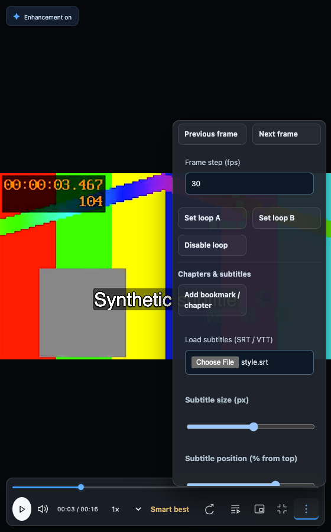
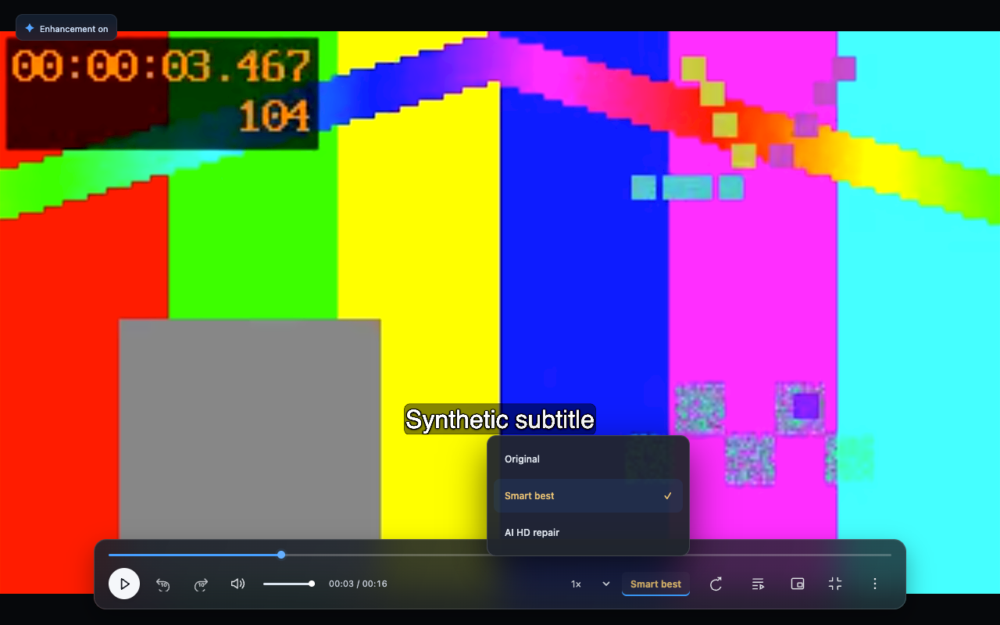

# WeScreen 1.17.0 · 完成范围与验证记录

日期：2026-10-04。本轮实际修改在扩展与本机服务中；数据库 `wescreen`、schema 4 保持不变。所有处理另存版本，原录像不被覆写或自动删除。

## 需求与直接证据

| 要求 | 最终行为 | 验证证据 |
| --- | --- | --- |
| 专业菜单排版 | 逐帧/循环、章节/字幕、声音/同步分区；文本按钮正常宽度；菜单限制屏幕边界，保留键盘焦点 | `scripts/test-polish.cjs` 真实 560 px 窄屏与原生全屏；`scripts/validate-package.cjs` 中英文五页 |
| 旧配对不反复阻断 | 新 ID 通过本机启动器确认；旧 ID 保留；过期凭证自动重取；后台不打开原生授权 | `tests/pairing_test.py` 权限、过期、跨 ID 与 URL 参数；`scripts/test-auto-connect.cjs` 原生扩展 Origin → 授权许可 → 重载连接，结果保留 |
| 持久播放列表与删除联动 | 保存引用，不复制视频；连续分段一条；跨页面更新、重载续播；回收/删除后移除 | `tests/library.browser.test.js` 实际 IndexedDB、Blob、两页面、重载和逐项删除 |
| 双向音画同步及声音保护 | -2 至 +2 秒、50 ms 微调；独立音频时钟跨段；25 ms 增益过渡；暂停、定位、缓冲停止音轨 | `scripts/test-polish.cjs` 两个符号的实际媒体时钟相差约目标值（误差阈值 200 ms）、增益、缓冲/播放；`scripts/test-pro.cjs` 真实独立音轨增益与暂停同步 |
| 原画按住对比 | 鼠标或键盘按住临时隐藏观看滤镜/实时画面，释放恢复，观看设置不重置 | `scripts/test-polish.cjs` 按住/释放、实际计算样式及滤镜保留；原文件从不改写 |
| 字幕与恢复 | 字幕字号/位置和原有偏移，跨段时间轴；恢复阶段状态、进度及失败提示 | `scripts/test-polish.cjs` 真实 SRT cue 与样式；`scripts/test-pro.cjs` 偏移/跨段；前端回归真实未完成 MP4 恢复、跨页面锁与完成录像不被覆盖 |
| 手动水印局部填补 | 固定选区映射到源像素，先预览，改选区后失效，整段另存；靠边提供裁剪入口 | `scripts/test-polish.cjs` 原生浏览器 + FFmpeg delogo 预览/另存；`tests/enhancement_test.py` 画面尺寸、音轨、非法边缘拒绝 |
| 超过一分钟末尾静止自动收尾 | 保存原录像后持久排队；默认静止且无声；同参数跨段保真合并后检测；保留最后有用画面约一秒并另存 | 78 秒合成媒体 → 少于 5 秒修剪版；原录像 SHA-256 一致。后端真实检测保护整段静止、内部静止后运动、带声静止；跨段检测通过且原分段字节一致 |
| 拖拽不卡队列、点击即播 | 拖动只更新目标，释放提交一次；点击开始播放；一个缩略图解码器、80 帧缓存/2 段 URL 缓存 | `scripts/test-polish.cjs` 连续 20 次跨段移动 0 次定位、释放 1 次定位；暂停中点击后实际开始播放；`scripts/test-tab-capture.cjs` 实际录制媒体拖拽 |
| 三项画质和清楚分辨率 | 原画、智能最佳、AI 高清修复；当前名称金色。分辨率和码率独立，4K/1440p/1080p/720p 显示像素与实际采集尺寸 | `scripts/test-polish.cjs` 选项、文字、金色计算样式；原生全屏实际截图；既有分辨率约束与码率回归 |
| 原位升级保留 | 原 ID、原数据库、原视频/恢复片段/任务/观看状态/偏好保留 | `scripts/test-upgrade.cjs` 隔离 Chromium 同一目录 1.13.0 → 1.17.0、schema 3 → 4，二进制 SHA-256 与完整状态逐项比对 |
| 本机启动和模型 | macOS 启动器已重新编译/注册 URL scheme；受管理进程 1.17.0；模型就绪 | 本机 `/health` 实际返回 1.17.0、nativePairing/smartTail/watermark/merge/AI/strong/realtime；生产实例 FSRCNN 320×180 → 640×360，单次推理 27.26 ms、冷请求往返 150.7 ms |

## 已运行的检查

- `NODE_PATH=… node --test tests/*.test.js`：41/41 通过，没有跳过。
- `enhancement/.venv/bin/python -m unittest discover -s tests -p '*_test.py'`：28 项，27 通过；SeedVR 大模型可选集成检查 1 项跳过。本轮不把模型文件“就绪”当成新增大模型质量测评。
- `node scripts/test-polish.cjs`、`node scripts/test-pro.cjs`、`node scripts/test-segments.cjs`、`node scripts/test-auto-connect.cjs`、`node scripts/test-tab-capture.cjs`、`node scripts/test-realtime.cjs`、`node scripts/test-upgrade.cjs`、`node scripts/validate-package.cjs` 均通过。
- 原生标签页采集实际得到变化的 H.264/AAC 媒体，源视频播放器静音时保留音轨，录完恢复静音；声音峰值 5169（16-bit PCM）。这只证明支持的标签页媒体路径，不代表所有系统窗口静音都能捕获声音。
- 实时神经网络端到端得到至少 5 个实际 FSRCNN 帧；原声时钟继续走、定位丢弃旧帧、旋转和原生全屏、导航清理及模拟慢推理回到原画均通过。
- `git diff --check`、JavaScript/Python 解析、shell 解析和打包白名单检查通过。扩展包只有扩展文件；本机包没有 `.runtime`、token、用户任务或 `.venv`。

## 真实界限与后续设备验收

这些是合成媒体、真实浏览器媒体 API、真实本机 FFmpeg/OpenCV 推理的验证，不是人工观看所有真实内容后的质量认证。

- Edge 的用户实际配置由用户重新加载验证；工具没有获得 Edge 操作权限。本机许可测试用隔离原生扩展和本地许可桥，不冒充已经人工点击过 Mac 的确认窗口。启动器的 AppleScript 实际编译、URL 注册和启动已验证。
- 没有承诺任何码流“零毫秒跳转”。关键帧距离、硬盘和浏览器解码会影响等待；点击开始解码与播放、拖拽避免重复任务。尚未测量 4K/8K 长 GOP 文件在各型号 Mac 上的首次目标帧延迟。
- 签名音频偏移依靠独立媒体元素，存在浏览器时钟误差；seek 与跨段有短暂静音，优先避免旧声音串出。没有宣称每个真实帧或采样点严格对齐。
- 静止检查是降采样图像变化 + 可选静音分析，不理解视频内容。微小游标/字幕、结束音乐、低声内容等可能影响判定。整片静止会保留；原片始终保留，结果可丢弃。大型素材分析耗时随时长增长，不能宣称录完立即完成。
- 同参数合并为编码流复制；不同参数明确要求兼容重编码后再检查。连续播放普通 video 元素切换仍可能有解码间隙，未宣称专业无缝 MSE。
- 固定区域 delogo 是邻域填补，可能产生模糊和痕迹；没有运动跟踪或扩散修补。当前文件为单位，多段需合并后再处理或逐段处理。靠边水印使用裁剪。
- 智能最佳默认保护高清来源和桌面文字，实时 FSRCNN 跟不上时回原画；离线 SeedVR2 仍限 1080p。不保证恢复丢失细节，也不是 HDR 转换。8K 原始采集依赖来源、编码器与设备，当前本机处理入口不承诺处理 8K。
- 字幕字号/位置保存为观看默认，本地字幕文件需再次导入；不会烧录到原视频。画中画使用浏览器原始方向，旋转请用全屏。
- 小时级 Telegram、睡眠唤醒、热负载、外接声音、低磁盘、长录制断电及不同 Edge/macOS 的稳定性还需真实设备长期验收。不能以短合成测试代替这些结果。

## 安装与交付

Edge 商店上传 `wescreen-1.17.0.zip`，本机增强程序使用 `wescreen-helper-1.17.0.zip`。开发版在原目录覆盖并重新加载同一扩展，不要先卸载或换目录；商店版更新同一条目。增强包保留原 `.runtime`、`.venv`、`models`，Mac 更新后再运行 `install-launcher.command`，本机确认新 ID 后自动重连。

这台 Mac 已在原目录安装新版启动器并运行 1.17.0；检查更新时任务数量为 0，没有中断用户任务。两包、SHA-256 与升级说明放在外部 `edge-store-1.17.0` 目录，并作为 GitHub v1.17.0 Release 附件发布。

实际渲染截图（合成素材）：

